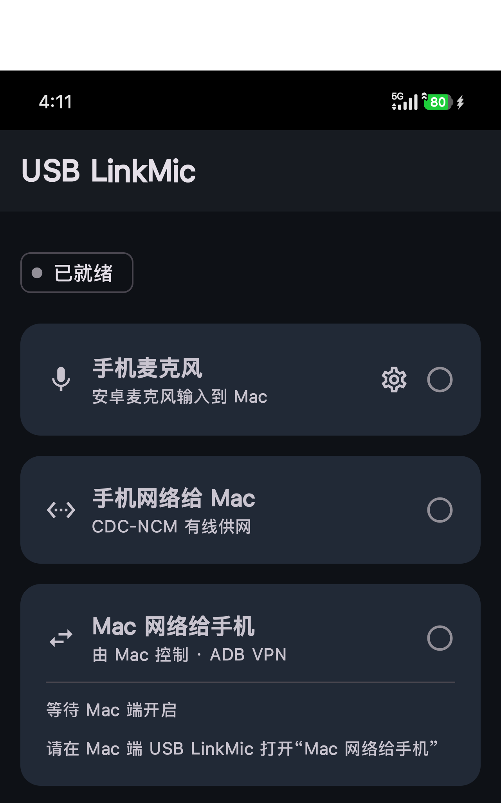

# USB LinkMic

<p align="center">
  <a href="README.zh-CN.md"><b>中文</b></a>
  &nbsp;|&nbsp;
  <a href="README.en.md"><b>English</b></a>
</p>

USB LinkMic is a macOS + Android toolkit for connecting an Android phone to a Mac over USB or LAN. It is not only a microphone app; it contains three major features:

- **Phone microphone to Mac**: stream Android microphone audio to the Mac and play it through a selected Mac output device.
- **Phone network to Mac**: share the phone network to the Mac over USB CDC-NCM/RNDIS.
- **Mac network to phone**: share the Mac network back to Android through an ADB reverse relay and Android VPN service.

<p align="center">
  
</p>

## Features

### Phone Microphone to Mac

- ADB mode: the Mac app configures `adb reverse` and starts the Android microphone service.
- Wi-Fi TCP mode: Android connects manually to the Mac IP and port on the same LAN.
- Configurable sample rate, channel count, sample format, audio source, mute, and gain.
- Selectable Mac audio output device, including system default output, built-in speakers, USB/Type-C audio devices, and virtual devices such as BlackHole.
- Live waveform and diagnostic logs in the Mac app.

### Phone Network to Mac

- The Mac app asks Android through ADB to switch USB function to `ncm`.
- It enables the phone-like network service on macOS and detects IP, router, default route, and USB function state.
- On stop, it disables the Mac-side phone network service and tries to restore the previous Android USB function.

This feature depends on whether the Android device/ROM allows `svc usb setFunctions ncm`.

### Mac Network to Phone

- The Mac app bundles and starts the official gnirehtet v2.5.1 Rust relay, so users do not need to install a separate relay.
- The Mac app creates `adb reverse localabstract:usblinkmic_net tcp:31416`.
- Android starts a VPN service and routes selected traffic/DNS through the Mac relay.
- Default DNS is `8.8.8.8`; default route is `0.0.0.0/0`. Both are configurable in the Mac app.

The first start requires Android VPN authorization.

The gnirehtet upstream source, pinned-version record, and Apache-2.0 license are in `third_party/gnirehtet/`. Rebuild the relay bundled with the Mac app from the included source by running `scripts/build-gnirehtet-relay.sh`.

## Requirements and Compatibility

| Item | Current requirement |
| --- | --- |
| Mac | Apple Silicon with macOS 26 or later |
| Android | Android 8.0 / API 26 or later |
| Tools | Android Platform Tools; `adb` available in the Mac shell |
| Connection | A data-capable USB cable; the same LAN for Wi-Fi mode |

Phone-to-Mac networking depends on whether the device ROM and USB controller allow switching to `ncm`/`rndis`; it is not available on every Android device. Mac-to-phone networking requires one-time Android VPN approval.

## Downloads

See GitHub Releases:

- `USBLinkMic-macOS.zip`: unzip and move `USB LinkMic.app` to `/Applications`.
- `USBLinkMic-android-debug.apk`: test APK, install with `adb install USBLinkMic-android-debug.apk`.

The Android artifact is currently a debug build. Build locally with your own keystore for production signing.

The macOS artifact currently targets Apple Silicon and is not Developer ID notarized. Gatekeeper or a third-party firewall may prompt on first launch; continue only after verifying that the file came from this repository's Release page.

## Usage

### Preparation

1. Enable Developer options and USB debugging on Android.
2. Install Android platform-tools on the Mac and make sure `adb` is available.
3. Approve the USB debugging prompt on the phone.

### Phone Microphone to Mac

ADB mode:

1. Connect the phone to the Mac over USB.
2. Open USB LinkMic on macOS.
3. Select ADB mode in Phone Microphone.
4. Select the desired Mac audio output device.
5. Turn the module on.

Wi-Fi TCP mode:

1. Put the phone and Mac on the same LAN.
2. Start the Wi-Fi TCP receiver in the Mac app.
3. Copy the displayed `IP:port`.
4. In the Android app, choose Wi-Fi TCP, enter that endpoint, and start streaming.

### Phone Network to Mac

1. Connect the phone to the Mac over USB.
2. Keep the phone unlocked so Android can switch USB function.
3. Turn on Phone Network to Mac in the Mac app.
4. Wait until macOS detects the CDC-NCM/RNDIS network service, IP, and router.

### Mac Network to Phone

1. Connect the phone to the Mac over USB.
2. Turn on Mac Network to Phone in the Mac app.
3. Accept the VPN permission prompt on Android.
4. Adjust DNS and routes in Mac settings if needed.

## Build

macOS:

```sh
./scripts/build-gnirehtet-relay.sh

xcodebuild \
  -project mac-native/USBLinkMicNative.xcodeproj \
  -scheme USBLinkMicNative \
  -configuration Release \
  -derivedDataPath mac-native/build/DerivedData \
  CODE_SIGNING_ALLOWED=NO \
  clean build
```

Android:

```sh
cd android
JAVA_HOME=/opt/homebrew/opt/openjdk@21/libexec/openjdk.jdk/Contents/Home \
ANDROID_HOME="$HOME/Library/Android/sdk" \
./gradlew :app:assembleDebug
```

## Layout

```text
.
├── android/          Android client
├── mac-native/       macOS client
├── Assets/           Icons and assets
├── docs/             Architecture and troubleshooting
├── third_party/      Pinned third-party source and licenses
└── outputs/          Local build artifacts, ignored by Git
```

## Privacy and Security

- No account is required, and the app does not include analytics or telemetry SDKs.
- Audio and forwarded traffic stay between Android, the USB/LAN link, and the Mac; they are not uploaded to a project server.
- The Android VPN only routes device traffic into the ADB relay. It is not an anonymity or end-to-end encryption service.
- USB debugging is powerful. Authorize only trusted computers and sanitize serial numbers, usernames, IPs, and local paths before sharing logs.

See the [security policy](SECURITY.md) and [third-party notices](THIRD_PARTY_NOTICES.md) for details.

## Documentation and Contributing

- [Architecture and data flows](docs/ARCHITECTURE.md)
- [Troubleshooting](docs/TROUBLESHOOTING.md)
- [Contributing guide](CONTRIBUTING.md)
- [Changelog](CHANGELOG.md)
- [Release checklist](docs/RELEASING.md)

## License

[MIT License](LICENSE)
