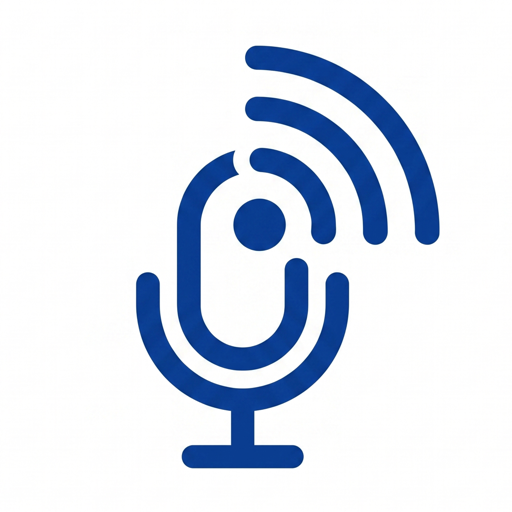
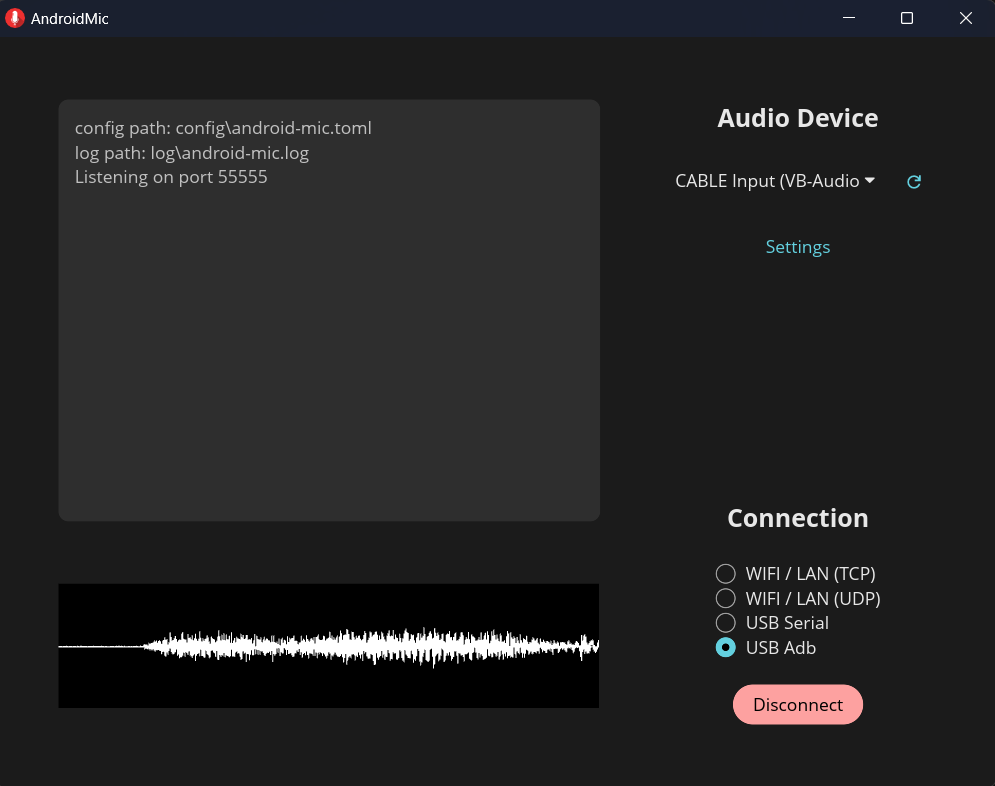
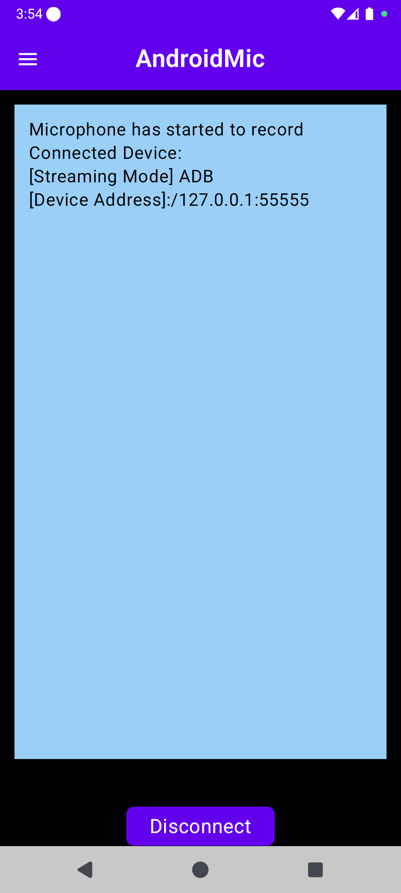
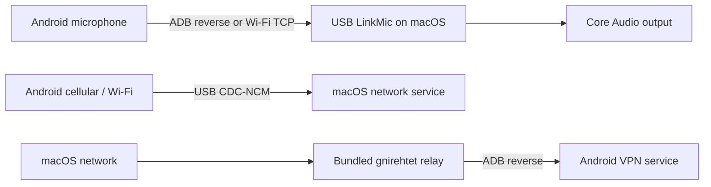

<div align="center">
  
  <h1>USB LinkMic</h1>
  <p><strong>One cable. Your Android microphone and network, available on your Mac.</strong></p>
  <p>
    Stream phone audio to macOS, tether Android data to your Mac, or share your Mac's network back to Android.
  </p>
  <p>
    <a href="README.zh-CN.md">简体中文</a>
    ·
    <strong>English</strong>
  </p>
  <p>
    <a href="https://github.com/xxkingstuggle/USBLinkMic/releases/latest"></a>
    <a href="https://github.com/xxkingstuggle/USBLinkMic/actions/workflows/android-ci.yml"></a>
    
    
    <a href="LICENSE"></a>
  </p>
  <p>
    <a href="https://github.com/xxkingstuggle/USBLinkMic/releases/latest"><strong>Download</strong></a>
    ·
    <a href="#quick-start"><strong>Quick start</strong></a>
    ·
    <a href="https://github.com/xxkingstuggle/USBLinkMic/issues"><strong>Get help</strong></a>
  </p>
</div>

<p align="center">
  
  &nbsp;
  
</p>

## Why USB LinkMic?

USB LinkMic brings three device-to-device tools into one native macOS + Android app:

| Mode | What it does | Connection |
| --- | --- | --- |
| **Phone microphone → Mac** | Plays Android microphone audio through any selected Mac output, including virtual audio devices | USB/ADB or Wi-Fi TCP |
| **Phone network → Mac** | Uses a phone's network connection from macOS | USB CDC-NCM |
| **Mac network → Phone** | Routes Android traffic through the Mac with a bundled reverse-tethering relay | USB/ADB + Android VPN |

- Native SwiftUI and Jetpack Compose interfaces
- No account, cloud service, ads, or analytics
- Selectable sample rate, channels, PCM format, audio source, gain, mute, and Mac output device
- Live waveform, connection state, and diagnostic logs
- Bundled, reproducible [gnirehtet](third_party/gnirehtet/UPSTREAM.md) relay source

## Compatibility

| Component | Requirement |
| --- | --- |
| Mac | macOS 26 or later; current bundled relay is Apple silicon (`arm64`) |
| Android | Android 8.0 (API 26) or later |
| USB modes | Android Developer options, USB debugging, and an authorized ADB connection |
| Phone network → Mac | A device/ROM that permits `svc usb setFunctions ncm`; support varies by vendor |
| Mac network → Phone | Android VPN permission on first use |

> [!IMPORTANT]
> The current Android release asset is a debug build, and the macOS app is not yet notarized. Review the [release notes](https://github.com/xxkingstuggle/USBLinkMic/releases/latest) before installing. This repository is the only official download source.

## Quick start

1. Download both apps from the [latest release](https://github.com/xxkingstuggle/USBLinkMic/releases/latest).
2. Move **USB LinkMic.app** to `/Applications` and install the APK:

   ```sh
   adb install USBLinkMic-android-debug.apk
   ```

3. Enable USB debugging on Android, connect the phone, and accept the authorization prompt.
4. Open USB LinkMic on both devices and choose a mode:

<details>
<summary><strong>Phone microphone → Mac</strong></summary>

1. On the Mac, choose **ADB** for USB or **Wi-Fi TCP** for a local-network connection.
2. Select the Mac audio output device. Use a virtual device such as BlackHole when another Mac app needs the audio as microphone input.
3. Start the receiver on the Mac, then start streaming on Android.

</details>

<details>
<summary><strong>Phone network → Mac</strong></summary>

1. Keep the phone connected and unlocked.
2. Enable **Phone network to Mac** in the Mac app.
3. Wait for macOS to detect the CDC-NCM service, IP address, and router.

This mode is device-dependent. Failure to switch the USB function usually means that the phone ROM blocks NCM tethering.

</details>

<details>
<summary><strong>Mac network → Phone</strong></summary>

1. Enable **Mac network to phone** in the Mac app.
2. Accept the VPN permission prompt on Android.
3. Adjust DNS and routes in Mac settings if the defaults do not match your network.

</details>

## How it works



The microphone path sends PCM audio packets to the Mac for low-overhead playback. Reverse tethering uses the pinned gnirehtet v2.5.1 Rust relay included in this repository; it can be rebuilt from source with `scripts/build-gnirehtet-relay.sh`.

## Build from source

### macOS

Requires Xcode 26 and Rust when rebuilding the bundled relay.

```sh
./scripts/build-gnirehtet-relay.sh

xcodebuild \
  -project mac-native/USBLinkMicNative.xcodeproj \
  -scheme USBLinkMicNative \
  -configuration Release \
  -derivedDataPath mac-native/build/DerivedData \
  clean build
```

### Android

Requires JDK 21 and the Android SDK.

```sh
cd android
./gradlew :app:assembleDebug
```

## Contributing and support

- Read [CONTRIBUTING.md](CONTRIBUTING.md) before opening a pull request.
- Use the structured [bug report](https://github.com/xxkingstuggle/USBLinkMic/issues/new?template=bug_report.yml) for reproducible problems.
- Use the [feature request](https://github.com/xxkingstuggle/USBLinkMic/issues/new?template=feature_request.yml) for proposals and use cases.
- Report vulnerabilities privately as described in [SECURITY.md](SECURITY.md).

When reporting a USB networking problem, include the phone model, Android version, ROM/vendor, macOS version, USB mode, and relevant logs. Compatibility is often device-specific.

## Project layout

```text
.
├── android/          Android client (Kotlin, Compose)
├── mac-native/       macOS client (Swift, SwiftUI, Core Audio)
├── third_party/      Pinned gnirehtet source and license
├── scripts/          Reproducible build helpers
└── Assets/           Icons and screenshots
```

## Acknowledgements

Reverse tethering is built on [Genymobile/gnirehtet](https://github.com/Genymobile/gnirehtet), included under the Apache-2.0 license. USB LinkMic itself is released under the [MIT License](LICENSE).
