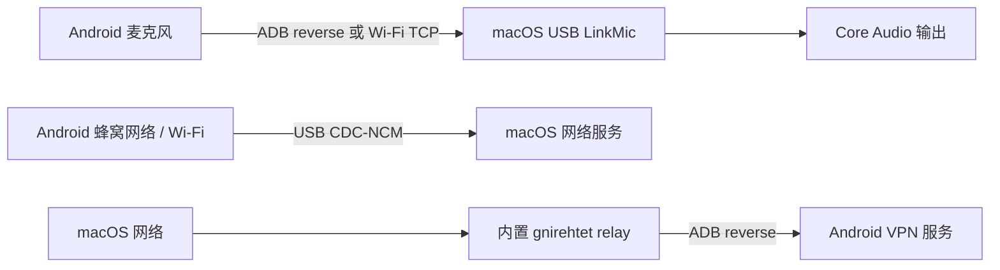

<div align="center">
  
  <h1>USB LinkMic</h1>
  <p><strong>一根数据线，让 Android 手机的麦克风与网络为 Mac 所用。</strong></p>
  <p>把手机麦克风传到 macOS、把手机网络共享给 Mac，或把 Mac 网络反向共享给 Android。</p>
  <p>
    <strong>简体中文</strong>
    ·
    <a href="README.md">English</a>
  </p>
  <p>
    <a href="https://github.com/xxkingstuggle/USBLinkMic/releases/latest"></a>
    <a href="https://github.com/xxkingstuggle/USBLinkMic/actions/workflows/android-ci.yml"></a>
    
    
    <a href="LICENSE"></a>
  </p>
  <p>
    <a href="https://github.com/xxkingstuggle/USBLinkMic/releases/latest"><strong>下载应用</strong></a>
    ·
    <a href="#快速开始"><strong>快速开始</strong></a>
    ·
    <a href="https://github.com/xxkingstuggle/USBLinkMic/issues"><strong>问题反馈</strong></a>
  </p>
</div>

<p align="center">
  
  &nbsp;
  
</p>

## USB LinkMic 能做什么？

USB LinkMic 把三种设备互联能力整合进原生 macOS + Android 应用：

| 模式 | 用途 | 连接方式 |
| --- | --- | --- |
| **手机麦克风 → Mac** | 将 Android 麦克风播放到指定 Mac 输出设备，也可接入虚拟声卡 | USB/ADB 或 Wi-Fi TCP |
| **手机网络 → Mac** | 让 macOS 使用手机的网络连接 | USB CDC-NCM |
| **Mac 网络 → 手机** | 通过内置反向中继，让 Android 流量经过 Mac | USB/ADB + Android VPN |

- SwiftUI 与 Jetpack Compose 原生界面
- 无账号、无云服务、无广告、无统计 SDK
- 可调采样率、声道、PCM 格式、音频源、增益、静音与 Mac 输出设备
- 实时波形、连接状态与诊断日志
- 内置并可复现构建的 [gnirehtet](third_party/gnirehtet/UPSTREAM.md) 中继源码

## 兼容性

| 组件 | 要求 |
| --- | --- |
| Mac | macOS 26 或更高版本；当前内置 relay 为 Apple 芯片（`arm64`）版本 |
| Android | Android 8.0（API 26）或更高版本 |
| USB 功能 | Android 已开启开发者选项、USB 调试，并完成 ADB 授权 |
| 手机网络 → Mac | 手机/ROM 允许 `svc usb setFunctions ncm`；不同厂商兼容性差异较大 |
| Mac 网络 → 手机 | 首次使用时允许 Android VPN 权限 |

> [!IMPORTANT]
> 当前 Android Release 仍是 debug 构建，macOS 应用尚未公证。安装前请阅读[最新发布说明](https://github.com/xxkingstuggle/USBLinkMic/releases/latest)。本仓库是唯一官方发布来源。

## 快速开始

1. 从 [Releases](https://github.com/xxkingstuggle/USBLinkMic/releases/latest) 下载 macOS 和 Android 两端应用。
2. 将 **USB LinkMic.app** 放入 `/Applications`，并安装 APK：

   ```sh
   adb install USBLinkMic-android-debug.apk
   ```

3. 在 Android 开启 USB 调试，连接手机并允许授权。
4. 在两端打开 USB LinkMic，选择所需模式：

<details>
<summary><strong>手机麦克风 → Mac</strong></summary>

1. 在 Mac 端选择 **ADB**（USB）或 **Wi-Fi TCP**（局域网）模式。
2. 选择 Mac 音频输出设备。如果要把手机音频作为其他 Mac 应用的麦克风输入，可选择 BlackHole 等虚拟声卡。
3. 先启动 Mac 接收端，再在 Android 开始推流。

</details>

<details>
<summary><strong>手机网络 → Mac</strong></summary>

1. 保持手机已连接并解锁。
2. 在 Mac 应用打开「手机网络给 Mac」。
3. 等待 macOS 检测到 CDC-NCM 服务、IP 与网关。

此模式依赖手机 ROM；如果无法切换 USB function，通常表示系统限制了 NCM 网络共享。

</details>

<details>
<summary><strong>Mac 网络 → 手机</strong></summary>

1. 在 Mac 应用打开「Mac 网络给手机」。
2. 在 Android 允许 VPN 权限。
3. 如果默认配置不适合当前网络，可在 Mac 设置中调整 DNS 与路由。

</details>

## 工作原理



麦克风链路将 PCM 音频包发送到 Mac 并低开销播放。反向网络共享使用仓库中固定版本的 gnirehtet v2.5.1 Rust relay，可通过 `scripts/build-gnirehtet-relay.sh` 从附带源码重新构建。

## 从源码构建

### macOS

需要 Xcode 26；重新构建内置 relay 时还需要 Rust。

```sh
./scripts/build-gnirehtet-relay.sh

xcodebuild \
  -project mac-native/USBLinkMicNative.xcodeproj \
  -scheme USBLinkMicNative \
  -configuration Release \
  -derivedDataPath mac-native/build/DerivedData \
  clean build
```

### Android

需要 JDK 21 与 Android SDK。

```sh
cd android
./gradlew :app:assembleDebug
```

## 参与贡献与获取帮助

- 提交 PR 前请先阅读 [CONTRIBUTING.md](CONTRIBUTING.md)。
- 可复现的问题请使用[错误报告](https://github.com/xxkingstuggle/USBLinkMic/issues/new?template=bug_report.yml)。
- 新想法和使用场景请使用[功能建议](https://github.com/xxkingstuggle/USBLinkMic/issues/new?template=feature_request.yml)。
- 安全漏洞请按照 [SECURITY.md](SECURITY.md) 私下报告。

反馈 USB 网络问题时，请务必附上手机型号、Android 版本、ROM/厂商、macOS 版本、USB 模式与相关日志。这类问题往往与具体设备有关。

## 项目结构

```text
.
├── android/          Android 客户端（Kotlin、Compose）
├── mac-native/       macOS 客户端（Swift、SwiftUI、Core Audio）
├── third_party/      固定版本的 gnirehtet 源码与许可证
├── scripts/          可复现构建脚本
└── Assets/           图标与截图
```

## 致谢与协议

反向网络共享基于 [Genymobile/gnirehtet](https://github.com/Genymobile/gnirehtet)，其附带源码使用 Apache-2.0 协议。USB LinkMic 本身使用 [MIT License](LICENSE)。
